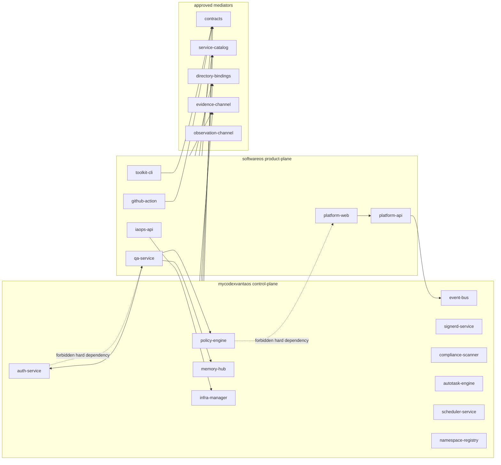
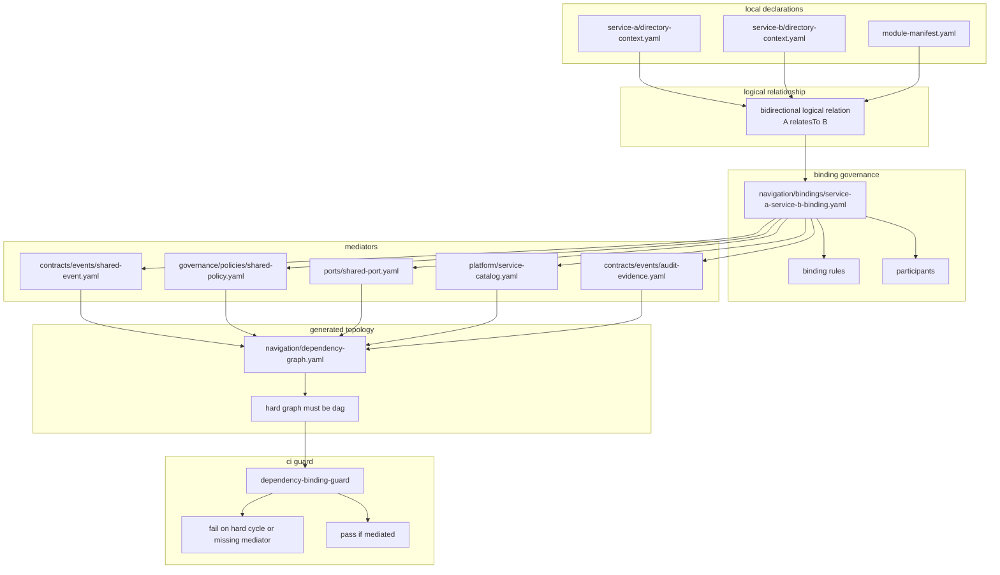
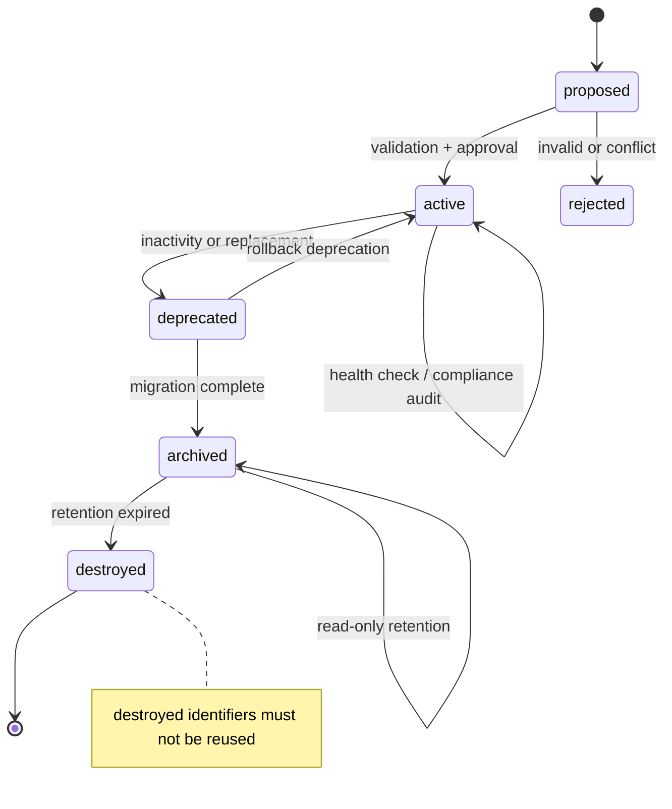

# MyCodexVantaOS — Namespace Governance Architecture Panorama and Directory Tree

> 文件定位：`docs/architecture/namespace-governance-architecture-panorama.md`  
> 對應規格：`docs/governance/namespace-governance-closure-spec.md`  
> 建議母規格章節：`Appendix J — Namespace Governance Architecture Panorama and Directory Tree`  
> 架構類型：治理閉環架構 / 命名空間控制平面 / CI 可驗證目錄拓撲 / binding-mediator 架構  
> 機器識別：`mycodexvantaos`  
> 品牌識別：`MyCodexVantaOS`  
> 狀態：normative  
> 命名規則：lowercase / kebab-case / no version in name / no environment marker  
> 執行語義：MUST / MUST NOT / SHOULD / MAY

---

## J.0 Architecture Intent

This document defines the full architecture panorama and repository directory tree for the `mycodexvantaos` namespace governance closure system.

The architecture implements the following final governance statement:

```text
namespace code defines governance identity.
repository name defines operational responsibility.
directory context defines local relationships.
binding manifest defines logical pairings.
mediator artifacts prevent hard dependency cycles.
registry records preserve lifecycle and audit.
ci enforces naming, mapping, dependency, and closure.
```

The system is organized as a machine-parseable governance repository that can be validated by CI.

---

# J.1 Architecture Panorama

## J.1.1 High-Level Governance Closure Panorama

```mermaid
flowchart TB
  subgraph external["external interaction layer"]
    git["git organization"]
    pr["pull request"]
    repo["repository names"]
    human["governance owners"]
  end

  subgraph ci["ci enforcement layer"]
    namingGuard["naming guard"]
    bindingGuard["dependency binding guard"]
    lifecycleGuard["lifecycle guard"]
    registryGuard["registry drift guard"]
    closureGuard["closure prover guard"]
    report["validation reports"]
  end

  subgraph governance["governance control plane"]
    baseline["namespace governance baseline\nmycodexvantaos-00000"]
    identifier["identifier standard\nmycodexvantaos-00100"]
    lifecycle["lifecycle standard\nmycodexvantaos-00200"]
    hierarchy["hierarchy standard\nmycodexvantaos-00300"]
    reference["cross-namespace reference\nmycodexvantaos-00400"]
    audit["audit trail\nmycodexvantaos-00700"]
    conflict["conflict resolution\nmycodexvantaos-00800"]
    migration["migration standard\nmycodexvantaos-00900"]
  end

  subgraph registries["registry and catalog layer"]
    nsRegistry["namespace registry"]
    codeRegistry["governance code registry"]
    repoRegistry["repository registry"]
    vocabRegistry["controlled vocabulary registry"]
    taskRegistry["automation task registry"]
    serviceCatalog["service catalog"]
    providerRegistry["provider registry"]
  end

  subgraph topology["relationship topology layer"]
    dirContext["directory-context.yaml"]
    moduleManifest["module-manifest.yaml"]
    dependencyPolicy["navigation/dependency-policy.yaml"]
    dependencyGraph["navigation/dependency-graph.yaml"]
    bindings["navigation/bindings/*.yaml"]
    exceptions["governance/dependency-exceptions.yaml"]
  end

  subgraph mediators["mediator artifact layer"]
    contracts["contracts"]
    schemas["schemas"]
    events["contracts/events"]
    ports["ports"]
    policies["governance/policies"]
    readModels["read-models"]
    workflows["workflows"]
    evidence["evidence"]
  end

  subgraph planes["namespace planes"]
    controlPlane["mycodexvantaos\ncontrol-plane"]
    productPlane["softwareos\nproduct-plane"]
  end

  subgraph runtime["automation runtime alignment"]
    eventBus["mycodexvantaos-event-bus"]
    policyEngine["mycodexvantaos-policy-engine"]
    scheduler["mycodexvantaos-scheduler-service"]
    autotask["mycodexvantaos-autotask-engine"]
    rollback["mycodexvantaos-rollback-engine"]
    complianceScanner["mycodexvantaos-compliance-scanner"]
    complianceReporter["mycodexvantaos-compliance-reporter"]
    prediction["mycodexvantaos-prediction-predictor"]
    alertd["mycodexvantaos-alertd-service"]
    qa["softwareos-qa-service"]
  end

  git --> pr
  pr --> namingGuard
  pr --> bindingGuard
  pr --> lifecycleGuard
  pr --> registryGuard
  pr --> closureGuard
  repo --> namingGuard
  human --> baseline

  namingGuard --> report
  bindingGuard --> report
  lifecycleGuard --> report
  registryGuard --> report
  closureGuard --> report

  baseline --> identifier
  baseline --> lifecycle
  baseline --> hierarchy
  baseline --> reference
  baseline --> audit
  baseline --> conflict
  baseline --> migration

  identifier --> codeRegistry
  lifecycle --> nsRegistry
  hierarchy --> nsRegistry
  reference --> dependencyPolicy
  audit --> registryGuard
  conflict --> dependencyPolicy
  migration --> serviceCatalog

  nsRegistry --> repoRegistry
  codeRegistry --> nsRegistry
  vocabRegistry --> repoRegistry
  taskRegistry --> serviceCatalog

  dirContext --> dependencyGraph
  moduleManifest --> dependencyGraph
  dependencyPolicy --> dependencyGraph
  bindings --> dependencyGraph
  exceptions --> dependencyGraph

  dependencyGraph --> bindingGuard
  dependencyPolicy --> bindingGuard
  bindings --> bindingGuard
  exceptions --> bindingGuard

  bindings --> contracts
  bindings --> events
  bindings --> ports
  bindings --> policies
  bindings --> workflows
  bindings --> evidence

  controlPlane --> eventBus
  controlPlane --> policyEngine
  controlPlane --> scheduler
  controlPlane --> autotask
  controlPlane --> rollback
  controlPlane --> complianceScanner
  controlPlane --> complianceReporter
  controlPlane --> prediction
  controlPlane --> alertd

  productPlane --> qa

  eventBus --> events
  rollback --> events
  complianceScanner --> events
  complianceReporter --> events
  prediction --> events
  alertd --> events
  policyEngine --> policies
  scheduler --> serviceCatalog
  autotask --> workflows
  qa --> contracts
  qa --> schemas

  productPlane -.may depend on contracts/services.-> controlPlane
  controlPlane -.must not hard-depend on product runtime.-> productPlane
```



---

## J.1.2 Namespace Plane Dependency Panorama



---

## J.1.3 Governance Code Taxonomy Panorama

```mermaid
flowchart TB
  root["mycodexvantaos governance code space\n00000-99999"]

  meta["00000-09999\nmeta-governance"]
  eraOne["10000-29999\nera-one\ncode and architecture"]
  eraTwo["30000-59999\nera-two\ndistributed runtime"]
  eraThree["60000-89999\nera-three\nintent and autonomy"]
  cross["90000-99999\ncross-era-governance"]

  root --> meta
  root --> eraOne
  root --> eraTwo
  root --> eraThree
  root --> cross

  meta --> c000["00000 baseline"]
  meta --> c001["00100 identifier"]
  meta --> c002["00200 lifecycle"]
  meta --> c003["00300 hierarchy"]
  meta --> c004["00400 reference"]
  meta --> c007["00700 audit"]
  meta --> c008["00800 conflict"]

  eraOne --> code["10000-19999\ncode namespace"]
  eraOne --> arch["20000-29999\narchitecture namespace"]

  eraTwo --> service["30000-39999\nservice namespace"]
  eraTwo --> data["40000-49999\ndata namespace"]
  eraTwo --> security["50000-59999\nsecurity namespace"]

  eraThree --> intent["60000-69999\nintent namespace"]
  eraThree --> semantic["70000-79999\nsemantic namespace"]
  eraThree --> autonomous["80000-82999\nautonomous namespace"]
  eraThree --> quantumRuntime["83000-84999\nquantum runtime"]
  eraThree --> quantumAlgo["85000-86999\nquantum algorithm"]
  eraThree --> quantumHybrid["87000-88999\nquantum-classical hybrid"]

  cross --> mapping["90100 mapping"]
  cross --> transform["90200 transformation"]
  cross --> compat["90300 compatibility"]
  cross --> migration["90400 migration"]
  cross --> monitor["90500 monitoring"]
  cross --> cost["90600 cost"]
  cross --> capacity["90700 capacity"]
  cross --> disaster["90800 disaster recovery"]
  cross --> archive["90900 archive"]
  cross --> destroy["91000 destruction"]
```



---

## J.1.4 Binding-Mediator Dependency Panorama



---

## J.1.5 Namespace Lifecycle Panorama



---

## J.1.6 CI Validation Panorama

```mermaid
flowchart TB
  pr["pull request"]

  subgraph inputs["ci inputs"]
    repos["repository names"]
    contexts["**/directory-context.yaml"]
    bindings["navigation/bindings/*.yaml"]
    policies["governance/policies/*.yaml"]
    registry["governance/registry/*.yaml"]
    vocab["governance/vocabularies/*.yaml"]
    lifecycle["governance/lifecycle/*.yaml"]
    schemas["schemas/*.schema.json"]
  end

  subgraph validators["validators"]
    naming["validate-naming"]
    schema["validate-schemas"]
    registryValidator["validate-registry"]
    lifecycleValidator["validate-lifecycle"]
    binding["validate-directory-bindings"]
    graph["validate-dependency-graph"]
    closure["validate-closure"]
  end

  subgraph outputs["ci outputs"]
    namingReport["naming-report.json"]
    registryReport["registry-report.json"]
    lifecycleReport["lifecycle-report.json"]
    dependencyReport["dependency-binding-report.json"]
    closureReport["closure-report.json"]
    summary["ci-governance-summary.json"]
  end

  pr --> inputs
  repos --> naming
  contexts --> binding
  contexts --> graph
  bindings --> binding
  policies --> schema
  registry --> registryValidator
  vocab --> naming
  lifecycle --> lifecycleValidator
  schemas --> schema

  naming --> namingReport
  registryValidator --> registryReport
  lifecycleValidator --> lifecycleReport
  binding --> dependencyReport
  graph --> dependencyReport
  closure --> closureReport

  namingReport --> summary
  registryReport --> summary
  lifecycleReport --> summary
  dependencyReport --> summary
  closureReport --> summary
```

---

# J.2 Canonical Repository Directory Tree

## J.2.1 Complete Governance Repository Tree

```text
mycodexvantaos-namespace-governance/
├── readme.md
├── license
├── codeowners
├── contributing.md
├── security.md
├── changelog.md
├── .gitignore
├── .gitattributes
├── package.json
├── pyproject.toml
├── makefile
├── version-lock.yaml
├── hashlock.json
│
├── .github/
│   ├── workflows/
│   │   ├── governance-ci.yaml
│   │   ├── naming-guard.yaml
│   │   ├── dependency-binding-guard.yaml
│   │   ├── registry-drift-guard.yaml
│   │   ├── lifecycle-guard.yaml
│   │   ├── closure-prover-guard.yaml
│   │   ├── schema-validation.yaml
│   │   └── release-governance.yaml
│   │
│   ├── pull-request-template.md
│   ├── issue-template/
│   │   ├── namespace-request.md
│   │   ├── governance-code-request.md
│   │   ├── dependency-exception-request.md
│   │   └── naming-violation-report.md
│   │
│   └── codeql/
│       └── codeql-config.yaml
│
├── docs/
│   ├── index.md
│   ├── glossary.md
│   ├── governance/
│   │   ├── namespace-governance-closure-spec.md
│   │   ├── namespace-governance-baseline.md
│   │   ├── namespace-identifier-standard.md
│   │   ├── namespace-lifecycle-standard.md
│   │   ├── namespace-registry-standard.md
│   │   ├── namespace-approval-workflow.md
│   │   ├── namespace-health-metrics.md
│   │   └── namespace-destruction-protocol.md
│   │
│   ├── architecture/
│   │   ├── namespace-governance-architecture-panorama.md
│   │   ├── directory-dependency-governance-spec.md
│   │   ├── bidirectional-relation-decoupling-spec.md
│   │   ├── strong-logical-coupling-decoupling-patterns-spec.md
│   │   ├── dependency-binding-guard-ci-spec.md
│   │   ├── control-plane-product-plane-boundary.md
│   │   ├── binding-mediator-reference-architecture.md
│   │   ├── cross-era-governance-architecture.md
│   │   └── closure-system-architecture.md
│   │
│   ├── ci/
│   │   ├── naming-guard-ci.md
│   │   ├── dependency-binding-guard-ci.md
│   │   ├── lifecycle-guard-ci.md
│   │   ├── registry-drift-guard-ci.md
│   │   └── closure-prover-ci.md
│   │
│   ├── examples/
│   │   ├── compliant-repository-names.md
│   │   ├── non-compliant-repository-names.md
│   │   ├── compliant-directory-context.md
│   │   ├── compliant-directory-binding.md
│   │   ├── compliant-registry-record.md
│   │   └── automation-task-alignment.md
│   │
│   └── diagrams/
│       ├── governance-closure-panorama.mmd
│       ├── namespace-plane-dependency.mmd
│       ├── governance-code-taxonomy.mmd
│       ├── binding-mediator-topology.mmd
│       ├── lifecycle-state-machine.mmd
│       └── ci-validation-flow.mmd
│
├── governance/
│   ├── baseline/
│   ├── codes/
│   ├── vocabularies/
│   ├── registry/
│   ├── lifecycle/
│   ├── approvals/
│   ├── policies/
│   ├── exceptions/
│   ├── audit/
│   └── metrics/
│
├── navigation/
│   ├── dependency-policy.yaml
│   ├── dependency-graph.yaml
│   ├── dependency-report.json
│   ├── dependency-cycles.json
│   ├── dependency-policy-violations.json
│   ├── bindings/
│   ├── maps/
│   └── indexes/
│
├── contracts/
│   ├── index.yaml
│   ├── openapi/
│   ├── events/
│   ├── schemas/
│   └── graphql/
│
├── schemas/
├── services/
├── platform/
├── ports/
├── capabilities/
├── workflows/
├── read-models/
├── evidence/
├── scripts/
├── tests/
├── outputs/
├── supply-chain/
└── archive/
```

The expanded canonical tree MAY be materialized with all governance code records, registry files, event contracts, schemas, validators, reports, and supply-chain evidence as defined in `Appendix I`.

---

# J.3 Minimal Production Tree

## J.3.1 Minimum Viable Structure

The full tree above is complete.  
For first implementation, the following minimal production tree is sufficient.

```text
mycodexvantaos-namespace-governance/
├── readme.md
├── package.json
├── pyproject.toml
├── makefile
│
├── .github/
│   └── workflows/
│       ├── naming-guard.yaml
│       ├── dependency-binding-guard.yaml
│       ├── registry-drift-guard.yaml
│       └── closure-prover-guard.yaml
│
├── docs/
│   ├── governance/
│   │   └── namespace-governance-closure-spec.md
│   └── architecture/
│       └── namespace-governance-architecture-panorama.md
│
├── governance/
│   ├── baseline/
│   │   └── namespace-governance-baseline.yaml
│   │
│   ├── codes/
│   │   ├── index.yaml
│   │   ├── meta-governance/
│   │   │   └── mycodexvantaos-00000.yaml
│   │   ├── era-one/
│   │   ├── era-two/
│   │   ├── era-three/
│   │   └── cross-era-governance/
│   │
│   ├── vocabularies/
│   │   ├── namespaces.yaml
│   │   ├── domains.yaml
│   │   ├── functions.yaml
│   │   ├── era-ids.yaml
│   │   ├── lifecycle-stages.yaml
│   │   └── atomic-categories.yaml
│   │
│   ├── registry/
│   │   ├── namespace-registry.yaml
│   │   ├── repository-registry.yaml
│   │   ├── governance-code-registry.yaml
│   │   └── automation-task-registry.yaml
│   │
│   ├── policies/
│   │   ├── naming-policy.yaml
│   │   ├── dependency-policy.yaml
│   │   ├── binding-mediator-policy.yaml
│   │   └── lifecycle-policy.yaml
│   │
│   └── exceptions/
│       └── dependency-exceptions.yaml
│
├── navigation/
│   ├── dependency-policy.yaml
│   ├── dependency-graph.yaml
│   └── bindings/
│       ├── automation-task-binding.yaml
│       └── binding-index.yaml
│
├── contracts/
│   ├── index.yaml
│   └── events/
│       ├── automation-event.yaml
│       ├── rollback-request.yaml
│       ├── compliance-finding.yaml
│       ├── prediction-alert.yaml
│       └── audit-evidence.yaml
│
├── schemas/
│   ├── namespace-governance-code.schema.json
│   ├── namespace-registry-record.schema.json
│   ├── directory-context.schema.json
│   ├── directory-binding.schema.json
│   └── ci-report.schema.json
│
├── platform/
│   └── service-catalog.yaml
│
├── scripts/
│   ├── validate-naming.py
│   ├── validate-directory-bindings.py
│   ├── validate-registry.py
│   ├── validate-lifecycle.py
│   └── validate-closure.py
│
├── tests/
│   ├── test-naming-validator.py
│   ├── test-directory-bindings.py
│   ├── test-registry-validator.py
│   └── test-closure-prover.py
│
└── outputs/
    ├── naming-report.json
    ├── dependency-binding-report.json
    ├── registry-report.json
    ├── lifecycle-report.json
    └── closure-report.json
```

---

# J.4 Directory Responsibilities

## J.4.1 Responsibility Matrix

| Directory                 | Responsibility                             | CI Validation                                    |
| ------------------------- | ------------------------------------------ | ------------------------------------------------ |
| `.github/workflows`       | CI gate definitions                        | workflow syntax and required jobs                |
| `docs`                    | human-readable specifications and diagrams | documentation link validation                    |
| `governance/baseline`     | root governance baseline                   | schema and immutability validation               |
| `governance/codes`        | governance code catalog                    | code regex and uniqueness                        |
| `governance/vocabularies` | controlled terms                           | domain/function/era validation                   |
| `governance/registry`     | namespace and repository registry          | registry drift validation                        |
| `governance/lifecycle`    | lifecycle policies                         | transition validation                            |
| `governance/approvals`    | approval workflow records                  | approval authority validation                    |
| `governance/policies`     | policy rules                               | policy schema validation                         |
| `governance/exceptions`   | controlled exceptions                      | expiration and owner validation                  |
| `governance/audit`        | append-only audit trail                    | append-only integrity validation                 |
| `governance/metrics`      | health and governance metrics              | metric schema validation                         |
| `navigation`              | dependency graph and binding topology      | hard DAG and mediator validation                 |
| `contracts`               | API, event, and schema contracts           | contract schema validation                       |
| `schemas`                 | JSON schema definitions                    | schema meta-validation                           |
| `services`                | governance service implementations         | directory-context and module-manifest validation |
| `platform`                | catalogs and ownership maps                | catalog consistency validation                   |
| `ports`                   | provider-neutral interfaces                | port existence validation                        |
| `capabilities`            | capability contracts                       | provider-consumer validation                     |
| `workflows`               | lifecycle and governance workflows         | workflow state validation                        |
| `read-models`             | query projections                          | projection schema validation                     |
| `evidence`                | audit and proof evidence schemas           | evidence chain validation                        |
| `scripts`                 | CI validator tools                         | unit tests                                       |
| `tests`                   | validation tests and fixtures              | test execution                                   |
| `outputs`                 | generated reports                          | artifact upload                                  |
| `supply-chain`            | SBOM, provenance, attestation              | supply-chain verification                        |
| `archive`                 | deprecated assets                          | no active reference validation                   |

---

# J.5 Canonical File Naming Policy

## J.5.1 File Naming Rules

All files SHOULD use lowercase kebab-case.

Compliant:

```text
namespace-governance-baseline.yaml
dependency-binding-guard.yaml
validate-directory-bindings.py
governance-code-registry.yaml
```

Non-compliant:

```text
NamespaceGovernanceBaseline.yaml
dependency_binding_guard.yaml
dependency.binding.guard.yaml
namespace governance.yaml
```

## J.5.2 Allowed File Extensions

Recommended extensions:

```text
.md
.yaml
.json
.py
.toml
.graphql
.mmd
```

If the repository follows a double-extension knowledge-base policy, the equivalent forms MAY be used:

```text
.md.txt
.yaml.txt
.json.txt
.py.txt
.graphql.txt
.mmd.txt
```

The canonical architecture assumes direct executable extensions.  
A knowledge-base export MAY transform them into double-extension assets.

---

# J.6 Key Machine-Readable Records

## J.6.1 Namespace Governance Code Record

```yaml
apiVersion: mycodexvantaos.io/v1
kind: NamespaceGovernanceCode

metadata:
  id: mycodexvantaos-50100
  organization: mycodexvantaos

spec:
  code: '50100'
  era: era-two
  family: security-namespace
  category: authentication
  title:
    zh-tw: 認證命名空間
    en: authentication namespace
  enforceLevel: mandatory
  lifecycle: active
  validationSchema: schemas/namespace-governance-code.schema.json
  owner: platform-security
```

## J.6.2 Namespace Registry Record

```yaml
apiVersion: mycodexvantaos.io/v1
kind: NamespaceRegistryRecord

metadata:
  id: mycodexvantaos-auth-service
  organization: mycodexvantaos

spec:
  namespace: mycodexvantaos
  plane: control-plane
  domain: auth
  function: service
  repository: mycodexvantaos-auth-service
  governanceCode: mycodexvantaos-50100
  era: era-two
  lifecycle: active
  owner: platform-security
  createdAt: '2026-01-01T00:00:00Z'
  status: active
```

## J.6.3 Directory Context Record

```yaml
apiVersion: mycodexvantaos.io/v1
kind: DirectoryContext

metadata:
  id: services/autotask-engine
  name: autotask-engine
  organization: mycodexvantaos

spec:
  namespace: mycodexvantaos
  plane: control-plane
  domain: autotask
  function: engine
  repository: mycodexvantaos-autotask-engine
  governanceCode: mycodexvantaos-60800

  dependencyMode:
    acceptsInboundHardDependencies: false
    allowsOutboundHardDependencies: true
    crossFoundationHardDependencies: forbidden
    preferredIntegration:
      - contracts
      - events
      - ports
      - bindings
      - registries

  related:
    hard:
      consumes:
        - id: automation-event
          path: contracts/events/automation-event.yaml
          relation: consumes-event
          reason: automation engine consumes governed automation events

    soft:
      references:
        - id: mycodexvantaos-policy-engine
          path: services/policy-engine/
          relation: governed-by-policy
          relationSemantics: orchestration-mediated
          hardDependency: false
          mediation:
            type: policy
            path: governance/policies/automation-policy.yaml
          reason: policy evaluation is mediated by automation policy
```

## J.6.4 Directory Binding Record

```yaml
apiVersion: mycodexvantaos.io/v1
kind: DirectoryBinding

metadata:
  name: automation-task-binding
  organization: mycodexvantaos

spec:
  relationType: automation-orchestration
  relationSemantics: orchestration-mediated
  hardDependency: false

  participants:
    - id: mycodexvantaos-event-bus
      path: services/event-bus/
      role: event-source

    - id: mycodexvantaos-policy-engine
      path: services/policy-engine/
      role: policy-evaluator

    - id: mycodexvantaos-scheduler-service
      path: services/scheduler/
      role: task-scheduler

    - id: mycodexvantaos-autotask-engine
      path: services/autotask-engine/
      role: task-executor

  mediation:
    type: event-contract-and-policy
    path: contracts/events/automation-event.yaml

  rules:
    - services MUST communicate through contracts or registries.
    - direct cyclic hard dependencies are forbidden.
    - policy evaluation MUST be mediated by governance policy.
    - task execution MUST emit audit evidence.
```

---

# J.7 CI Gates and Commands

## J.7.1 Required CI Gates

```text
naming-guard
schema-validation
dependency-binding-guard
registry-drift-guard
lifecycle-guard
closure-prover-guard
release-governance
```

## J.7.2 Local Commands

```bash
make validate-naming
make validate-schemas
make validate-directory-bindings
make validate-registry
make validate-lifecycle
make validate-closure
make validate-all
```

## J.7.3 Package Scripts

```json
{
  "scripts": {
    "validate:naming": "python3 scripts/validate-naming.py",
    "validate:schemas": "python3 scripts/validate-yaml-schema.py",
    "validate:directory-bindings": "python3 scripts/validate-directory-bindings.py",
    "validate:registry": "python3 scripts/validate-registry.py",
    "validate:lifecycle": "python3 scripts/validate-lifecycle.py",
    "validate:closure": "python3 scripts/validate-closure.py",
    "validate:all": "npm run validate:naming && npm run validate:schemas && npm run validate:directory-bindings && npm run validate:registry && npm run validate:lifecycle && npm run validate:closure"
  }
}
```

---

# J.8 Rollout Phases

```text
phase-one
  establish baseline, vocabularies, governance codes, registry skeleton

phase-two
  enable repository naming guard and governance code validator

phase-three
  enable directory-context and binding-mediator validation

phase-four
  enable lifecycle, approval, archive, and destruction governance

phase-five
  enable closure prover and cross-era mapping validation

phase-six
  enforce all gates as blocking ci checks
```

---

# J.9 Final Architecture Statement

This architecture is complete when:

```text
every namespace has a registry record.
every governance code has a machine-readable code record.
every repository name maps to namespace, domain, and function.
every directory declares its local relationship through directory-context.yaml.
every bidirectional logical relation has a directory binding.
every binding has a mediator.
every mediator exists as a contract, policy, port, registry, catalog, workflow, or evidence artifact.
every lifecycle transition is auditable.
every destroyed namespace is non-reusable.
every CI gate produces a report.
every report is indexable and auditable.
```

Final rule:

```text
if it cannot be parsed, validated, indexed, audited, and governed by ci,
it does not belong in the mycodexvantaos namespace governance closure architecture.
```
